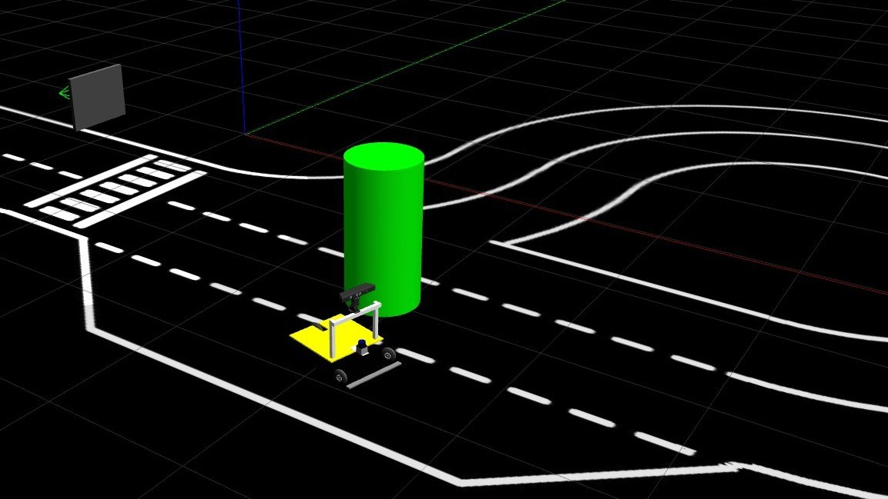
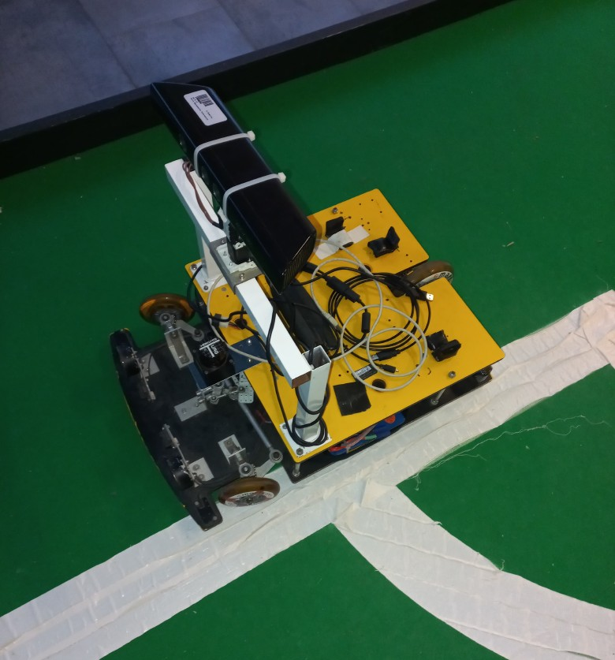
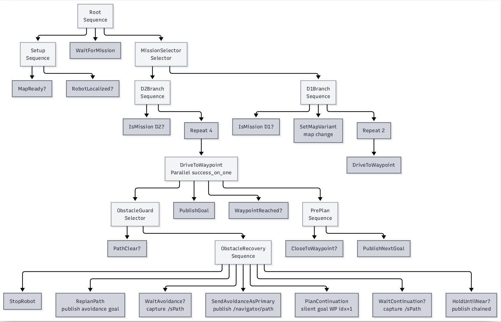
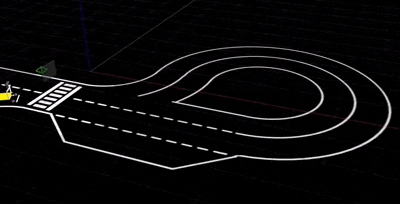
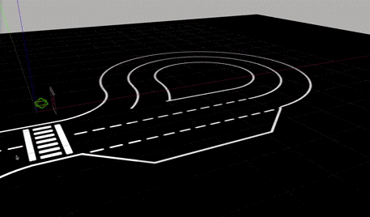
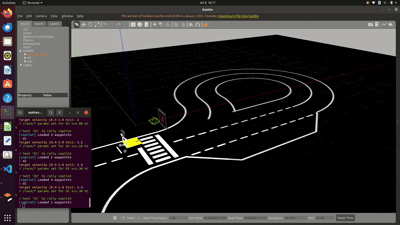

# Behavior Trees for Autonomous Ackermann Robot Navigation and Obstacle Recovery

> A reactive, mission-aware navigation system for the **ROTA** autonomous robot, built around a **Behavior Tree** mission manager.
> Developed in collaboration with the **University of Aveiro (IRIS Lab)** for the **Festival Nacional de Robótica (FNR)**.

<!-- TODO: add a hero image or GIF (e.g. the robot avoiding an obstacle in Gazebo) -->

---

##  About this repository

This repository is a **showcase** of the project. It contains **no source code**: the software was developed jointly with the University of Aveiro and other contributors, and it cannot be made public at this time.

What you will find here is a description of the work, the results achieved, and the plots and videos that demonstrate them.

 **Paper:** *Integration of Behavior Trees for Autonomous Robot and Obstacle Recovery* — M. Polo, P. Rasinhas, A. Pereira.
<!-- TODO: add link to the paper (arXiv / DOI / PDF) when available -->

---

##  Table of contents

1. [Overview](#-overview)
2. [Key contributions](#-key-contributions)
3. [System at a glance](#-system-at-a-glance)
4. [Results](#-results)
   - [E1 — Velocity sweep (endurance)](#e1--velocity-sweep-d2-endurance)
   - [E2 — Obstacle recovery](#e2--obstacle-recovery-with-chained-hand-off-d3)
   - [E3 — Reverse parking](#e3--reverse-parking-d1)
5. [Tech stack](#-tech-stack)
6. [Limitations and future work](#-limitations-and-future-work)
7. [Credits](#-credits)
8. [Contact](#-contact)

---

##  Overview

Autonomous ground robots competing in the FNR must handle three very different challenges under a single mission manager:

| Challenge | Description |
|-----------|-------------|
| **D1 — Parking** | Forward-reverse parking maneuver |
| **D2 — Endurance** | Two-lap run around the track |
| **D3 — Obstacles** | Two-lap run with obstacles appearing at runtime |

The first version of the mission logic was a **finite state machine**: effective in nominal conditions, but brittle when conditions change at runtime and increasingly hard to extend as new missions were added.

This project replaces it with a **Behavior Tree (BT)** that acts as the central mission manager. It orchestrates a complete autonomy stack (planning, velocity profiling and path tracking) and makes the robot **reactive**: it can recover from unexpected obstacles without aborting the mission.

**The platform — ROTA (Robô Tricicló de Aveiro):** a small-scale (60 × 45 cm) three-wheeled robot with Ackermann steering, developed at the IRIS laboratory of the University of Aveiro. All the evaluation shown here was performed in a high-fidelity **Gazebo** simulation of the competition scenarios.

<!-- TODO: add a photo of the real ROTA robot -->

---

##  Key contributions

###  1. Behavior-Tree mission manager
A single, declarative tree replaces the old navigator and the separate recovery logic. Waypoint progression, planning requests, controller supervision and obstacle recovery all live in the same structure, which makes it modular, readable and easy to extend with new missions.

###  2. Chained hand-off for obstacle recovery
When an obstacle invalidates the current trajectory, the BT requests a new avoidance path and hands control over to it. After a single stop at detection, the robot **keeps rolling** while it leaves the avoidance arc and rejoins the nominal mission, without stopping again and without losing its tracking state.

###  3. Velocity-driven adaptive tuning
The operator chooses **one number**: the target lap velocity. The system derives all the speed-dependent settings of the planner, velocity profiler and controllers automatically, with no per-mission code edits and no manual re-tuning.

---

##  System at a glance

The stack is built on ROS and organised around three main components coordinated by the Behavior Tree:

- **Behavior Tree node:** mission manager and decision-making
- **Planner:** generates kinematically feasible paths for the Ackermann robot, forward and in reverse
- **Controller:** tracks the planned path and the speed profile

<!-- TODO: add the Behavior Tree topology diagram (Fig. 2 of the paper) -->

---

##  Results

**Headline numbers**

| Metric | Result |
|--------|--------|
| Mean cross-track error (endurance, 0.8–2.0 m/s) | **2.8 – 8.5 cm** |
| Obstacle injections resolved by chained hand-off | **27 / 27** |
| Missions aborted during recovery | **0** |
| Velocity tracking ratio (endurance) | **> 90 %** up to 1.6 m/s, ≈ 88 % at 2.0 m/s |
| Mean cross-track error (reverse parking) | **1.9 – 3.4 cm** |

---

### E1 — Velocity sweep (D2 endurance)

Two-lap run at four target velocities, five runs each, to characterise tracking performance as speed increases.

**Takeaways:** the same stack runs the track from 0.8 to 2.0 m/s with no manual re-tuning. Errors grow smoothly with speed, and the realised velocity stays close to the target.

** Video: full lap at 0.8 m/s and 2.0 m/s**
<!-- TODO: add video (drag & drop the .mp4 here in the GitHub editor, or link a GIF) -->

---

### E2 — Obstacle recovery with chained hand-off (D3)

Two-lap run with **three obstacles injected per mission**, at three target velocities, three runs each (9 missions, 27 injections in total).

**Takeaways:** every obstacle was resolved without aborting the mission. After the single stop at detection, the robot rejoined the nominal path while still moving.

** Video: obstacle avoidance in Gazebo**

---

### E3 — Reverse parking (D1)

Reverse-parking maneuver at three target velocities, three runs each.

**Takeaways:** the same stack delivers the precision a parking task demands, with cross-track error roughly half and heading error about a third of the endurance values at similar speeds.

**🎬 Video: parking maneuver**

*Coming soon*

---

##  Tech stack

- **ROS** for inter-node communication and parameter management
- **Gazebo** for high-fidelity simulation
- **Python** with **py_trees** for the Behavior Tree
- **Ruckig** for jerk-limited velocity profiles

---

##  Limitations and future work

- Validation on the **physical ROTA platform**, with real perception replacing the simulated obstacle flag
- Extension of the recovery behavior to **dynamic (moving) obstacles**
- Smoother acceleration and braking through richer velocity profiling
- Model-based longitudinal control and online re-computation of speed-dependent parameters
- Sustained reverse driving, building on the accurate reverse tracking observed in E3

---

##  Credits

Developed at the **Intelligent Robotics and Intelligent Systems Laboratory (IRIS)**, **University of Aveiro**, Portugal, in collaboration with the **University of Padua**, Italy.

**Authors:** Matteo Polo, P. Rasinhas, A. Pereira

This project builds on the earlier navigation stack for ROTA by P. Rasinhas (*Reactive and deliberative navigation for an Ackermann robot*, Master's thesis, Universidade de Aveiro, 2025).

---

Source code is not publicly available. For questions about the project, please get in touch.
